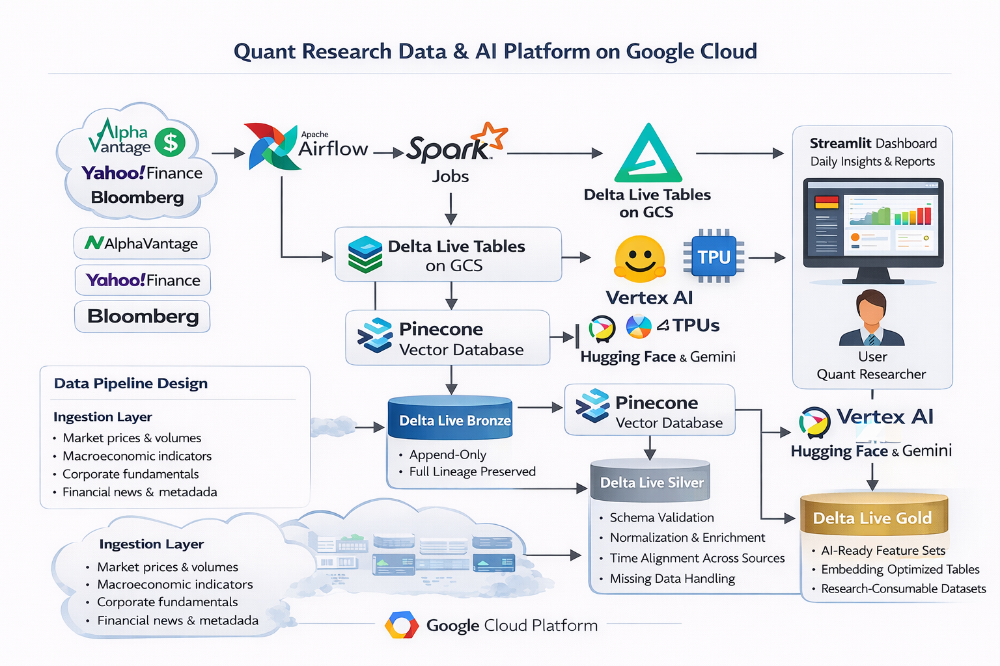

# Quant Research Data & AI Platform on Google Cloud
*A Production-Grade Data & AI Engineering Platform for Financial Market Research*

This project implements a **realistic, end-to-end data and AI platform** designed to support **quantitative research and market intelligence workflows** in financial services.

It combines **cloud-native data engineering**, **vector-based AI workloads**, and **daily research insight delivery**, closely mirroring how modern quant research teams operate in production environments.

The solution emphasizes **data quality, reproducibility, scalable model pipelines, and researcher-facing usability**.

---

## Architecture Overview

---

## Business Use Case

**Industry:** Financial Services  
**Primary Users:** Quantitative Researchers, Data Scientists, AI Engineers  

**Objectives:**
- Ingest and standardise multi-source financial market data
- Produce AI-ready, embedding-optimised datasets
- Train and run research models  daily 
- Deliver time-aware insights to researchers before market open
- Support historical comparison and backtesting of model outputs

---

## Key Features

### Financial Data Engineering (Production-Grade)

- **Scheduled ingestion** of structured and semi-structured financial data
- **Append-only raw data storage** for traceability and replay
- **Schema enforcement and validation** using Delta Live Tables
- **Deterministic transformations** ensuring reproducible model inputs
- **Partitioned, time-aware datasets** optimised for research workloads

---

### AI-Ready Data & Vectorisation

- Feature engineering tailored for:
  - Time series analysis
  - Market regime detection
  - NLP-driven financial research
- Embedding generation aligned with **vector database best practices**
- Optimised storage for similarity search, retrieval, and downstream AI use cases

---

### Model Training & Research Workloads

- **Vertex AI** for managed training and experimentation
- **TPU-backed workloads** for high-throughput model execution
- **Hugging Face models** for financial NLP and representation learning
- **Gemini models on Vertex AI** for advanced summarisation and reasoning
- Daily retraining or inference pipelines driven by fresh market data

---

### Research Insight Delivery

- **Daily automated research summaries**
- Delivered via a **Streamlit frontend** designed for researchers
- Dropdown-based navigation allowing:
  - Current day insights
  - Historical summaries (up to previous 7 days)
- Clear separation between:
  - Data processing
  - Model execution
  - Research consumption

---

## Data Pipeline Design

### Ingestion Layer
**Sources include:**
- Market prices & volumes
- Macroeconomic indicators
- Corporate fundamentals
- Financial news & metadata

Data is fetched via external APIs and landed in **Google Cloud Storage** in an immutable format.

---

### Processing & Validation (Delta Live Tables)

**Bronze**
- Raw API responses
- Append-only
- Full lineage preserved

**Silver**
- Schema validation
- Normalisation and enrichment
- Time alignment across sources
- Missing data handling

**Gold**
- AI-ready feature sets
- Embedding-optimised tables
- Research-consumable datasets

---

## Orchestration Strategy

- **Apache Airflow (Cloud Composer)**
- Daily DAG schedule:
  - API ingestion
  - Spark transformation
  - Data quality checks
  - Vectorisation
  - Model execution
  - Insight generation

**SLA-driven design:**  
Insights are guaranteed to be available before the start of the research day.

---

## Frontend & Research Experience

### Streamlit Research Console
- Clean, minimal UI for quant workflows
- Daily summary views
- Historical comparison support
- Model outputs presented with timestamps and data versioning

---

## Tech Stack

| Layer | Technology | Purpose |
|------|-----------|---------|
| Cloud Platform | Google Cloud Platform | Core infrastructure |
| Orchestration | Apache Airflow | Scheduling & dependencies |
| Processing | Apache Spark | Large-scale transformations |
| Data Quality | Delta Live Tables | Validation & enforcement |
| Storage | Google Cloud Storage | Lakehouse storage |
| Vector Store | Pinecone | Embedding search & retrieval |
| AI Platform | Vertex AI | Training & inference |
| Accelerators | TPU | High-performance compute |
| Models | Hugging Face, Gemini | Financial NLP & reasoning |
| Frontend | Streamlit | Research delivery |
| Language | Python | Pipelines & modelling |

---

## Engineering Principles Demonstrated

- Separation of data, model, and presentation layers
- Reproducible, time-aware pipelines
- Production-style orchestration and SLAs
- AI systems built on governed, high-quality data
- Research-first UX design

---

## Project Outcome

This repository demonstrates **how modern financial research platforms are actually built**, combining:

- Cloud-scale data engineering  
- AI-ready lakehouse design  
- Vector-native architectures  
- Managed ML infrastructure  
- Researcher-facing delivery  

---

**Status:** Portfolio / Demonstration Project  
**Audience:** Data Engineers, AI Engineers, Machine Learning Engineers, Quantitative Research Technologists
